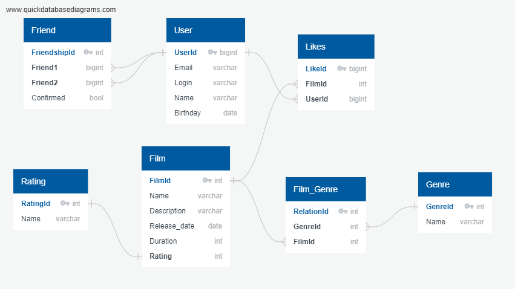

# java-filmorate

Примеры запросов к базе данных

**Получение всех друзей пользователя 2:**

**SELECT** u.UserId, u.Email, u.Login, u.Name, u.Birthday\
**FROM** Friend **AS** f\
**JOIN** User **AS** u **ON** u.UserId = f.friend2\
**WHERE** f.Friend1 = 2 **AND** f.Confirmed = 1\
**UNION**\
**SELECT** u.UserId, u.Login, u.Name\
**FROM** Friend **AS** F\
**JOIN** User **AS** u **ON** u.UserId = f.friend1\
**WHERE** f.Friend2 = 2 **AND** f.confirmed = 1;

**Получение всех названий фильмов, которые понривились пользователю 1:**

**SELECT** f.Name\
**FROM** Film **AS** f\
**JOIN** Likes **AS** l **ON** f.FilmId = l.FilmId\
**JOIN** User **AS** u **ON** u.UserId = l.UserId\
**WHERE** u.UserId = 1;